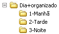

Dia mais organizado
=====================

Faça uma estrutura de pastas com os turnos do dia ordenados, de acordo com a imagem abaixo.

    
Terminada esta atividade, vá fazer a atividade sobre :doc:`../refeicao/index`.
    
    