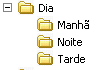

Dia
==========

Faça uma estrutura de pastas com os turnos do dia, de acordo com a imagem abaixo.

    
Terminada esta atividade, vá fazer a atividade sobre :doc:`../dia+organizado/index`.
    
    