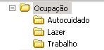

Ocupação
=================

Faça uma estrutura de pastas sobre sua ocupação, de acordo com a imagem abaixo.

    
Terminada esta atividade, vá fazer a atividade sobre :doc:`../apresentacao/index`.
    
    