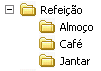

Refeição
=================

Faça uma estrutura de pastas para as refeições do dia, de acordo com a imagem abaixo.

    
Terminada esta atividade, vá fazer a atividade sobre :doc:`../refeicao+organizada/index`.
    
    